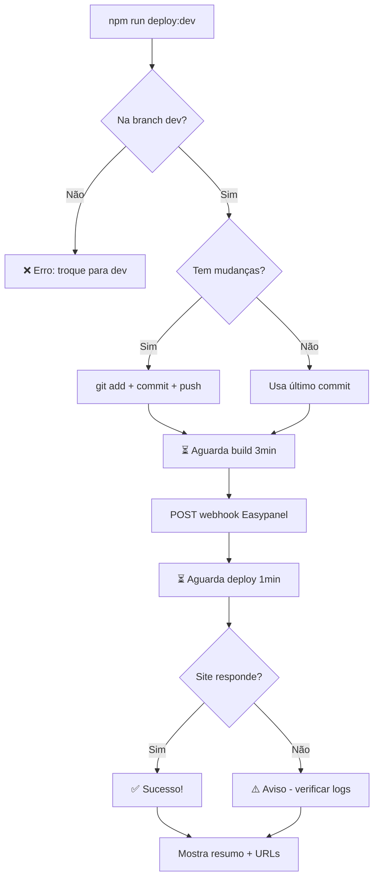

# Deploy Automation - Script Automático

Script customizado que automatiza todo o fluxo de deploy no ambiente DEV, desde commit até verificação do site online.

## 🎯 O que o script faz

1. ✅ Verifica se está na branch `dev`
2. ✅ Detecta mudanças não commitadas
3. ✅ Faz commit e push (se necessário)
4. ⏳ Aguarda GitHub Actions buildar imagem (~3 minutos)
5. 🚀 Trigger deploy no Easypanel via webhook
6. ⏳ Aguarda container reiniciar (~1 minuto)
7. 🏥 Verifica se site está online e respondendo
8. 📊 Mostra resumo com URLs e próximos passos

---

## 🚀 Como Usar

### Uso Básico

```bash
# Se tem mudanças para commitar
npm run deploy:dev

# Ou com mensagem de commit customizada
npm run deploy:dev "feat: adiciona nova funcionalidade"
```

### Com Flags

```bash
# Pula aguardar build (se build já foi feito)
npm run deploy:dev -- --skip-build

# Não faz health check final
npm run deploy:dev -- --no-verify

# Aguarda apenas 2min em vez de 3min
npm run deploy:dev -- --fast

# Combinar flags
npm run deploy:dev "fix: corrige bug" -- --fast --no-verify
```

**Nota:** O `--` é necessário antes das flags para o npm passar corretamente para o script.

---

## 📋 Exemplo de Output

```
╔═══════════════════════════════════════════════════════════╗
║        🚀 Deploy Automático - Ambiente DEV               ║
╚═══════════════════════════════════════════════════════════╝

🔍 Verificando branch...
✓ Branch correta: dev

🔍 Verificando mudanças...
📝 5 arquivo(s) modificado(s)

📦 Fazendo commit e push...
✓ Arquivos staged
✓ Commit: feat: adiciona logging customizado
✓ Push concluído
   SHA: 54eba21

⏳ Aguardando GitHub Actions buildar imagem...
   Tempo estimado: 180s (~3 min)
⏳ Build em progresso 0s restantes...
✓ ⏳ Build em progresso concluído!

🚀 Triggering deploy no Easypanel...
✓ Deploy triggered com sucesso!
   Status: 200

⏳ Aguardando container reiniciar...
   Tempo estimado: 60s
⏳ Deploy em progresso 0s restantes...
✓ ⏳ Deploy em progresso concluído!

🏥 Verificando se site está online...
   URL: https://automatize-nla-portal-dev.keoloh.easypanel.host/
   Tentativa 1/3...
✓ Site está online e respondendo!
   Status: 200

⏱️  Tempo total: 245s (~5 min)

═══════════════════════════════════════════════════════════
✅ DEPLOY DEV CONCLUÍDO COM SUCESSO!
═══════════════════════════════════════════════════════════

🚀 Informações:
   Branch: dev
   Commit: 54eba21 (2025-12-28)
   Build: ~3 min
   Deploy: ~60s

🌐 URLs:
   Site DEV: https://automatize-nla-portal-dev.keoloh.easypanel.host/
   GitHub: https://github.com/NLA-Consultoria/nla-consultoria/tree/dev

📊 Próximos passos:
   • Testar funcionalidades no ambiente DEV
   • Verificar logs no Easypanel (automatize/nla-portal-dev)
   • Validar analytics e tracking de eventos
```

---

## ⚙️ Configuração

### Endpoints e Timings

Configurados em `scripts/deploy-dev.js`:

```javascript
const CONFIG = {
  branch: 'dev',
  easypanel: {
    webhook: 'http://37.60.247.149:3000/api/deploy/9f39a3d3dd7f246526cfe27d138cf149b3c238fef23b5de7',
    siteUrl: 'https://automatize-nla-portal-dev.keoloh.easypanel.host/',
  },
  timings: {
    buildWait: 180,           // 3 minutos para build
    deployWait: 60,           // 1 minuto para deploy
    healthCheckRetries: 3,    // 3 tentativas de health check
    healthCheckInterval: 10,  // 10s entre tentativas
  },
};
```

### Modificar Timings

Se o build geralmente leva mais ou menos tempo, ajuste:

```javascript
buildWait: 240,  // 4 minutos
```

### Mudar URLs

Se mudar domínio do DEV ou webhook:

```javascript
easypanel: {
  webhook: 'http://novo-webhook-url',
  siteUrl: 'https://novo-dominio-dev.com',
},
```

---

## 🔧 Como Funciona

### 1. Verificação de Branch

```javascript
const currentBranch = exec('git branch --show-current');
if (currentBranch !== 'dev') {
  throw new Error('Troque para a branch dev');
}
```

Garante que está na branch `dev` antes de continuar.

### 2. Detecção de Mudanças

```javascript
const status = exec('git status --porcelain');
const hasChanges = !!status;
```

Verifica se há arquivos modificados, staged, ou untracked.

### 3. Commit e Push

Se houver mudanças:
```bash
git add .
git commit -m "mensagem"
git push origin dev
```

Pega SHA do commit para mostrar no resumo.

### 4. Aguardar Build

Aguarda 3 minutos (configurável) com progresso visual:
```
⏳ Build em progresso 145s restantes...
```

Atualiza a cada segundo mostrando contagem regressiva.

### 5. Trigger Deploy

Chama webhook via HTTP POST:
```javascript
const response = await httpPost(CONFIG.easypanel.webhook);
```

Verifica se retornou status 2xx (sucesso).

### 6. Aguardar Deploy

Aguarda 60 segundos para container reiniciar.

### 7. Health Check

Tenta acessar o site até 3 vezes:
```javascript
const response = await httpGet(CONFIG.easypanel.siteUrl);
if (response.statusCode === 200) {
  // Sucesso!
}
```

Se falhar nas 3 tentativas, mostra aviso mas não falha o deploy.

---

## 📊 Exit Codes

| Code | Significado |
|------|-------------|
| 0 | Deploy concluído com sucesso |
| 1 | Erro durante processo (branch errada, webhook falhou, etc) |

**Health check falhando não causa exit code 1** - apenas mostra aviso.

---

## 🐛 Troubleshooting

### "Branch atual: main, Esperado: dev"

**Problema:** Não está na branch dev

**Solução:**
```bash
git checkout dev
npm run deploy:dev
```

### "Command failed: git push"

**Problema:** Conflito com remote ou sem permissão

**Solução:**
```bash
# Pull primeiro
git pull origin dev

# Resolve conflitos se houver
git status

# Tenta de novo
npm run deploy:dev
```

### Webhook retorna erro 404/500

**Problema:** URL do webhook mudou ou Easypanel está offline

**Solução:**
1. Verificar URL do webhook no Easypanel
2. Atualizar em `scripts/deploy-dev.js`
3. Commit a mudança

### Site não responde após deploy

**Problema:** Container não iniciou ou erro no código

**Solução:**
```bash
# Verificar logs no Easypanel
# automatize → nla-portal-dev → Logs

# Ou via CLI (se tiver acesso SSH)
docker logs nla-portal-dev
```

Possíveis causas:
- Erro no código causando crash
- Variáveis de ambiente faltando
- Porta 3000 já em uso

### Build demora mais de 3 minutos

**Problema:** Build mais lento que o normal

**Solução temporária:**
```bash
# Aguardar mais tempo
npm run deploy:dev -- --skip-build
# Espera manualmente o build terminar
# Então roda de novo sem --skip-build
```

**Solução permanente:**
Aumentar `buildWait` em `scripts/deploy-dev.js`:
```javascript
buildWait: 240, // 4 minutos
```

---

## 🎯 Casos de Uso

### Deploy Rápido (sem mudanças)

Se fez push manualmente e só quer trigger deploy:
```bash
npm run deploy:dev -- --skip-build
```

### Deploy Silencioso (CI/CD)

Para usar em pipelines automatizadas:
```bash
npm run deploy:dev "chore: deploy automático" -- --no-verify
```

### Deploy Ultra-Rápido (desenvolvimento)

Durante desenvolvimento ativo, para iterar rápido:
```bash
npm run deploy:dev "wip: testando" -- --fast --no-verify
```

**Aviso:** Pode falhar se build realmente demorar mais de 2min.

---

## 📚 Arquivos Relacionados

```
scripts/
├── deploy-dev.js         # Script principal de automação
└── start.js              # Script de inicialização com logging

.claude/skills/
└── deploy-dev.md         # Skill para Claude Code

docs/project/
├── DEPLOY-AUTOMATION.md  # Esta documentação
└── DEPLOYMENT-DEV.md     # Guia manual de deploy DEV

package.json              # npm run deploy:dev
```

---

## 🔄 Workflow Completo



---

## ✨ Melhorias Futuras

Possíveis expansões do script:

- [ ] Integração com GitHub API para verificar status do workflow
- [ ] Notificação no Slack/Discord quando deploy concluir
- [ ] Rollback automático se health check falhar
- [ ] Deploy em múltiplos ambientes (staging, QA, prod)
- [ ] Validação de testes antes de deployar
- [ ] Screenshot automático do site após deploy

---

**Última atualização:** 2025-12-28
**Mantido por:** Equipe de Desenvolvimento NLA
